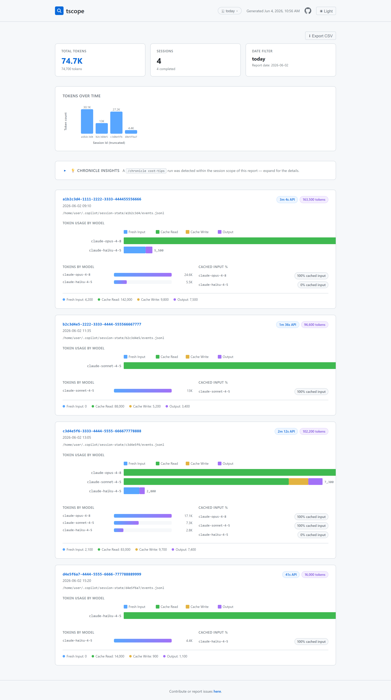

# tscope

**GitHub Copilot session token usage analyzer.**

> [!WARNING]
> **Alpha software** — tscope is early-stage and may have bugs. Behavior, output format, and JSON schema are subject to change. Use at your own discretion, and please [report any issues](https://github.com/robpitcher/tscope/issues) you find! 🙏

`tscope` is a command-line tool that reads your local Copilot CLI session files, measures tokens used per model (input, output, cache read, cache write), and displays a clear report — in the terminal, as JSON, or as an interactive HTML dashboard.

## HTML Dashboard Preview

The `--html` dashboard follows your system's light/dark theme:

<!-- The two images below use GitHub's theme-aware suffixes so only the one matching your theme renders. -->
<picture>
  <source media="(prefers-color-scheme: dark)" srcset="docs/images/dashboard-dark.png">
  
</picture>

> _Generated from synthetic sample data._

## Features

- 📊 **Local-only analysis** — no network calls, no credentials needed
- 🔍 **Per-session breakdown** — view token usage by session and model
- 📅 **Today's default** — shows current day's sessions by default
- 📈 **HTML dashboard** — sleek dashboard with token charts, an interactive date-range filter, and system light/dark theme
- 💡 **Chronicle Insights** — if a session ran `/chronicle tips` or `/chronicle cost-tips`, the recommendations are surfaced in the HTML dashboard
- 📤 **JSON output** — machine-readable schema (`tscope/report/v4`) for scripting

## Quick Start

```bash
npm install -g tscope
tscope --html # generate and open an HTML dashboard
```

Requires **Node.js 18+**.

## Command-Line Parameters

| Parameter | Values | Description | Required |
| --- | --- | --- | --- |
| `--all` | _(none)_ | Include all sessions (disables the default date filter). | No |
| `--date` | `YYYY-MM-DD` | Show sessions that started on the given local date. | No |
| `--help`, `-h` | _(none)_ | Show usage and options, then exit. | No |
| `--html` | `[FILE]` (optional path) | Write a self-contained HTML dashboard to `FILE` (or a default filename) and open it. | No |
| `--json` | _(none)_ | Emit the report as JSON (`tscope/report/v4`) to stdout instead of formatted text. | No |
| `--lastdays` | `N` (positive integer) | Show sessions from the last `N` days (today plus the previous `N − 1`). | No |
| `--max` | `N` (positive integer) | After date filtering, keep only the `N` most recent sessions (ordered by start time, newest first). | No |
| `--range` | `START END` (two `YYYY-MM-DD` values) | Show sessions in the given local-date range, inclusive. | No |
| `--version`, `-v` | _(none)_ | Print the installed version and exit. | No |

With no flags, `tscope` reports today's sessions in formatted text. Date filters (`--date`, `--range`, `--lastdays`, `--all`) are mutually exclusive. See [Usage](docs/usage.md) for full details.

## Documentation

Full documentation lives in the [`docs/`](docs/) folder:

- [Installation](docs/installation.md)
- [Usage](docs/usage.md) — CLI flags, date filtering, output formats, sample output
- [How It Works](docs/how-it-works.md) — session discovery, token accounting, resumed sessions
- [JSON Output](docs/json-output.md) — `tscope/report/v4` schema reference
- [HTML Dashboard](docs/html-dashboard.md) — dashboard features, Chronicle Insights, interactive date filter
- [Development](docs/development.md) — build, test, lint, project structure
- [Contributing](docs/contributing.md) — roadmap, license

## License

MIT.

---

Built with ❤️ for developers optimizing their Copilot CLI usage.
